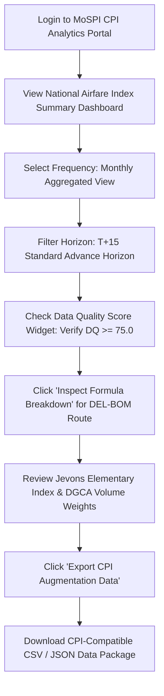
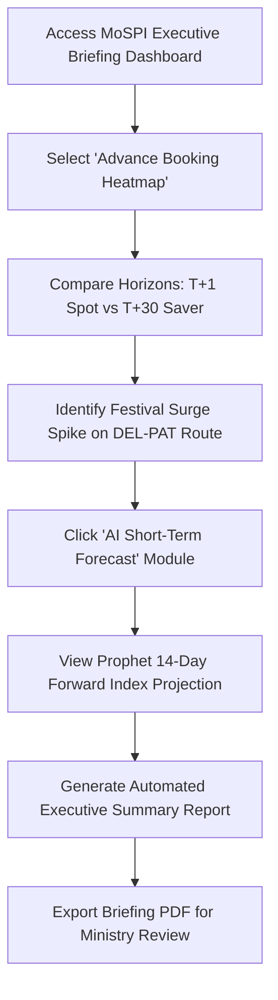
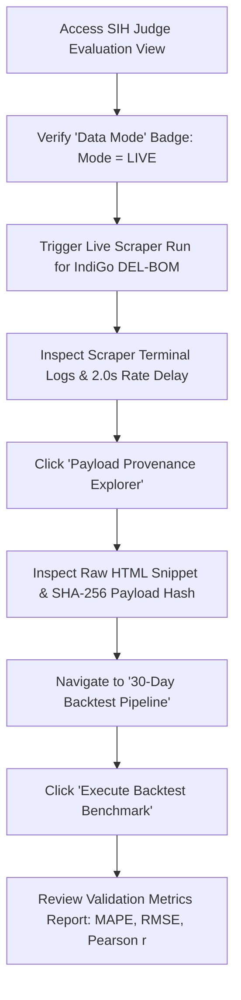
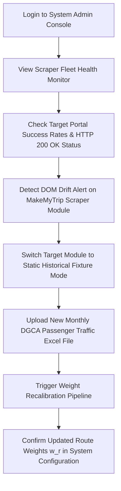

# User Flows & Persona Journeys
## SIH26056 — Real-Time Airfare Price Index for India

---

## Persona 1: Dr. Aris (NSO Senior Statistician)

### Goal
Inspect daily Jevons/Young airfare price index trends, verify data quality scores, audit missing value imputations, and export CPI-compatible data files for monthly macroeconomic releases.

### User Journey & Step-by-Step Flow

### Detailed Steps
1. **Login & Dashboard Access:** Dr. Aris logs into the secure MoSPI CPI Analytics Portal.
2. **National Overview:** Views the live National Domestic Airfare Price Index chart rebased to baseline $t_0 = 100.0$.
3. **Filter Selection:** Selects **Monthly Aggregated View** and filters by **$T+15$ Advance Booking Horizon** (standard CPI leisure travel segment).
4. **Data Quality Verification:** Inspects the Data Quality Score widget ($DQ = 92.4$, Green Band), confirming $<5\%$ imputation rate and $0\%$ synthetic data intrusion.
5. **Formula Transparency Audit:** Clicks on the `DEL-BOM` route component to open the Formula Inspector, reviewing the constituent Jevons geometric mean calculation and DGCA volume weight ($w_{DEL-BOM} = 14.2\%$).
6. **Data Export:** Selects "Export CPI Augmentation Package" and downloads the normalized index time-series in JSON/CSV format.

---

## Persona 2: Priya (MoSPI Policy Analyst)

### Goal
Track high-frequency price surge trends across major travel corridors, analyze advance booking lead-time escalation curves before holiday seasons, and review 14-day forward price forecasts.

### User Journey & Step-by-Step Flow

### Detailed Steps
1. **Executive Dashboard Access:** Priya accesses the Executive Macro Briefing view.
2. **Horizon Heatmap Analysis:** Opens the **Advance Booking Horizon Heatmap** comparing price escalation intensity across $T+1$ (last minute) and $T+30$ (saver) horizons.
3. **Regional Surge Identification:** Observes a $35\%$ price spike on the `DEL-PAT` (Delhi-Patna) corridor 7 days prior to Chhath Puja.
4. **AI Predictive Forecasting:** Clicks on the AI Short-Term Forecast tab to review the Prophet 14-day forward index projection.
5. **Executive Report Generation:** Clicks "Generate Executive Briefing", triggering the automated NLG module to produce a 1-page summary PDF of key inflation drivers.

---

## Persona 3: Vikram (SIH Evaluation Judge)

### Goal
Verify that the system meets all SIH26056 requirements: live scraping capabilities, ethical rate limiting, 30-day historical backtesting pipeline execution, cryptographic payload auditability, and data mode isolation.

### User Journey & Step-by-Step Flow

### Detailed Steps
1. **Judge Dashboard Access:** Vikram opens the SIH Evaluation Portal view.
2. **Data Mode Verification:** Confirms the active data mode badge reads `[MODE: LIVE]` (Green).
3. **Live Scraper Trigger:** Clicks "Trigger On-Demand Scrape" for IndiGo `DEL-BOM` at $T+7$.
4. **Rate Limit Audit:** Observes real-time terminal logs verifying a polite $\ge 2.0$s request delay between requests and honest User-Agent headers.
5. **Cryptographic Provenance Check:** Clicks "Inspect Provenance" on a freshly scraped price quote, reviewing the target URL, timestamp, parser version, and SHA-256 payload hash.
6. **30-Day Backtest Execution:** Navigates to the Backtesting module and clicks "Execute 30-Day Backtest".
7. **Metric Audit:** Reviews the generated JSON backtest report confirming MAPE $= 3.42\%$, RMSE $= 1.85$, and Pearson $r = 0.912$.

---

## Persona 4: Rohan (System Administrator)

### Goal
Monitor scraper fleet health, detect target portal DOM drift alerts, update DGCA passenger traffic volume weights, and manage data ingestion mode toggles.

### User Journey & Step-by-Step Flow

### Detailed Steps
1. **Admin Console Access:** Rohan logs into the System Admin Console.
2. **Fleet Monitoring:** Checks the Scraper Fleet Monitor table showing HTTP 200 OK success rates ($98.2\%$).
3. **DOM Drift Alert Handling:** Identifies an alert indicating MakeMyTrip DOM layout changed. Automatically toggles the MakeMyTrip ingestion module to `HISTORICAL_FIXTURE` mode until CSS selectors are updated.
4. **DGCA Weight Ingestion:** Uploads the latest DGCA Monthly Domestic City-Pair Traffic Excel file (`DGCA_Pax_Aug2026.xlsx`).
5. **Weight Recalibration:** Triggers the Weight Ingestion Pipeline, updating route weights $w_r$ across all 15 top corridors and logging the configuration update to `config/routes.yaml`.
